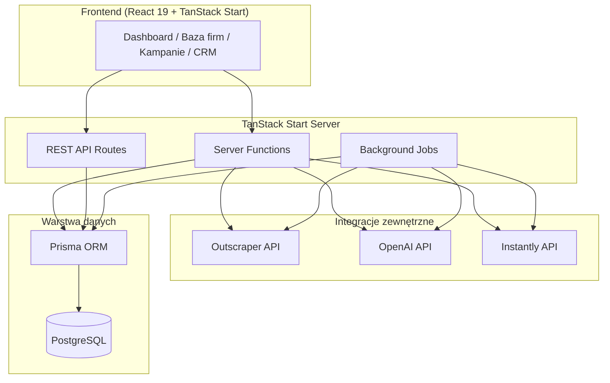
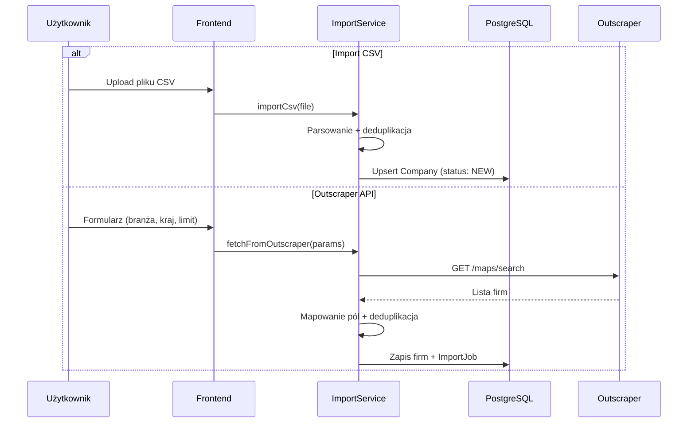
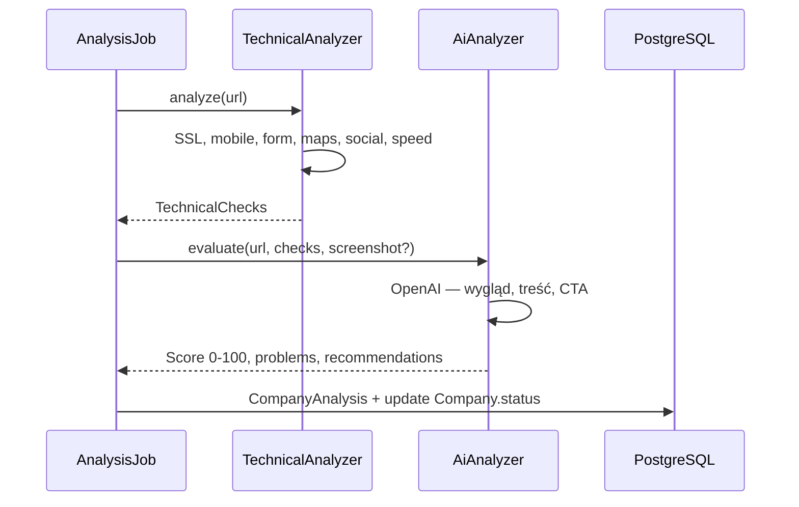
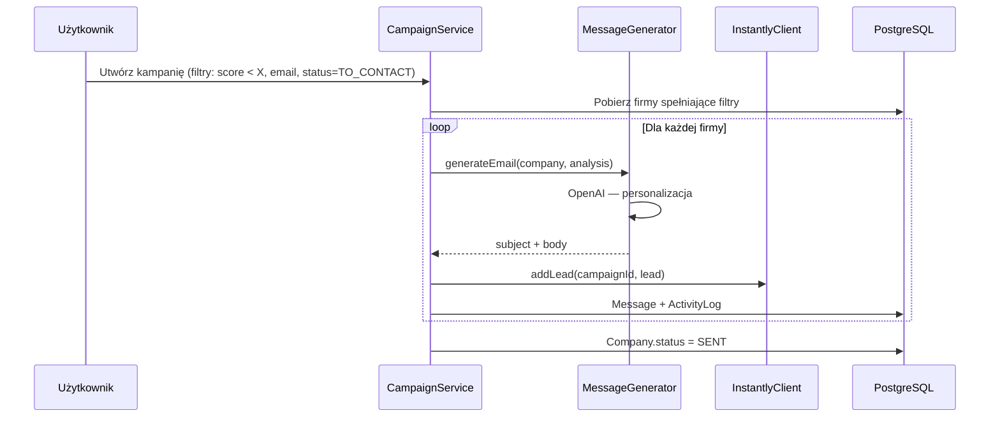

# Lead Generator — Architektura projektu

Aplikacja SaaS do pozyskiwania klientów dla agencji tworzącej strony internetowe (Pixel-app).

## 1. Przegląd systemu

Lead Generator łączy pozyskiwanie leadów (Outscraper), analizę stron WWW (techniczna + AI), generowanie spersonalizowanych wiadomości (OpenAI) oraz wysyłkę kampanii (Instantly) w jednym panelu z prostym CRM.



## 2. Stos technologiczny

| Warstwa | Technologia | Rola |
|---------|-------------|------|
| Framework full-stack | TanStack Start | SSR, routing, server functions, API routes |
| UI | React 19 | Komponenty interfejsu |
| Język | TypeScript | Typowanie end-to-end |
| Stylowanie | Tailwind CSS | Utility-first CSS |
| Komponenty UI | shadcn/ui | Primitives (Button, Table, Dialog, Form…) |
| Baza danych | PostgreSQL | Relacyjna baza produkcyjna |
| ORM | Prisma | Migracje, typy, zapytania |
| AI | OpenAI API | Ocena stron, raporty, generowanie emaili |
| Leady | Outscraper API | Wyszukiwanie firm po branży i kraju |
| Email outreach | Instantly API | Kampanie, leady, statystyki, odpowiedzi |

## 3. Wzorce architektoniczne

### 3.1 Multi-tenancy (fundament SaaS)

Każda organizacja (`Organization`) to izolowany tenant. Wszystkie encje biznesowe mają `organizationId` i są filtrowane na poziomie serwera.

```
User ──< OrganizationMember >── Organization
                                      │
                    ┌─────────────────┼─────────────────┐
                    ▼                 ▼                 ▼
               Company           Campaign          ApiCredential
```

- **Organizacja** — workspace agencji (np. Pixel-app)
- **Użytkownik** — konto logowania; może należeć do wielu organizacji
- **OrganizationMember** — rola w organizacji (`OWNER`, `ADMIN`, `MEMBER`)
- **ApiCredential** — zaszyfrowane klucze API per organizacja (Outscraper, Instantly, OpenAI)

### 3.2 Warstwy aplikacji

```
routes/          →  warstwa prezentacji (strony, layouty)
components/      →  komponenty UI (dumb + smart)
server/          →  logika serwerowa (services, repositories)
lib/             →  utilities, klienty API, walidacja
prisma/          →  schemat i migracje bazy
```

**Zasada:** route'y i server functions są cienkie — delegują do `server/services/`.

### 3.3 Server Functions vs API Routes

| Mechanizm | Zastosowanie |
|-----------|--------------|
| **Server Functions** (`createServerFn`) | Operacje CRUD z UI, mutacje, loadery danych |
| **API Routes** (`server/routes/api/`) | Webhooki Instantly, health check, ewentualne publiczne endpointy |
| **Background Jobs** | Analiza stron (wiele URL-i), import CSV, sync Instantly |

### 3.4 Przepływ danych — główne scenariusze

#### Import firm (CSV / Outscraper)



**Deduplikacja** — unikalność w obrębie organizacji po kombinacji:
- `website` (znormalizowany URL) **lub**
- `email` (jeśli brak WWW) **lub**
- `name + city` (fallback)

#### Analiza strony WWW



**Kategorie wyniku:**

| Zakres | Kategoria |
|--------|-----------|
| 0–30 | Krytyczna |
| 31–50 | Słaba |
| 51–70 | Przeciętna |
| 71–85 | Dobra |
| 86–100 | Bardzo dobra |

#### Kampania mailingowa



## 4. Moduły funkcjonalne (MVP)

### 4.1 Dashboard

Agregaty per organizacja (cache opcjonalny w przyszłości):

| Metryka | Źródło |
|---------|--------|
| Firmy w bazie | `COUNT(Company)` |
| Przeanalizowane strony | `COUNT(Company WHERE status >= ANALYZED)` |
| Do kontaktu | `COUNT(Company WHERE status = TO_CONTACT)` |
| Wysłane wiadomości | `COUNT(Message WHERE sentAt IS NOT NULL)` |
| Odpowiedzi | `COUNT(Reply)` lub `COUNT(Company WHERE status = REPLIED)` |

### 4.2 Baza firm

Centralna encja `Company` ze statusami workflow:

```
NEW → ANALYZED → TO_CONTACT → SENT → REPLIED → CLIENT
```

Przejścia statusów mogą być ręczne (CRM) lub automatyczne (po analizie / wysyłce / webhooku Instantly).

### 4.3 Analiza stron

**Warstwa techniczna** (`TechnicalAnalyzer`):
- SSL — certyfikat HTTPS, data ważności
- Responsywność — viewport meta, media queries (heurystyka)
- Formularz kontaktowy — detekcja `<form>`, pola email/tel
- Google Maps — embed / link do maps.google.com
- Social media — linki do FB, IG, LinkedIn, X
- Szybkość — Lighthouse API lub PageSpeed Insights API (opcjonalnie uproszczony fetch timing)

**Warstwa AI** (`AiAnalyzer`):
- Prompt z kontekstem technicznym + opis strony
- Ocena: wygląd, jakość treści, CTA
- Wynik 0–100 + lista problemów + rekomendacje

### 4.4 Generator wiadomości AI

Szablon bazowy:
- **Temat:** `Kilka uwag dotyczących strony {{company_name}}`
- **Treść:** wynik analizy, 3 problemy, propozycja modernizacji, podpis Pixel-app

Generowanie per firma na podstawie `CompanyAnalysis`.

### 4.5 Integracja Instantly

| Operacja | Endpoint Instantly (przykład) |
|----------|-------------------------------|
| Tworzenie kampanii | `POST /api/v1/campaigns` |
| Dodawanie leadów | `POST /api/v1/leads` |
| Wysyłka do kampanii | batch add leads |
| Statystyki | `GET /api/v1/campaigns/{id}/analytics` |
| Odpowiedzi | webhook + polling `GET /api/v1/emails/replies` |

Webhook Instantly → `POST /api/webhooks/instantly` → aktualizacja `Reply`, `Company.status`, `ActivityLog`.

### 4.6 CRM

`ActivityLog` — jednolita historia zdarzeń:

| Typ | Opis |
|-----|------|
| `ANALYSIS_COMPLETED` | Zakończona analiza strony |
| `MESSAGE_SENT` | Wysłany email |
| `REPLY_RECEIVED` | Otrzymana odpowiedź |
| `NOTE_ADDED` | Notatka użytkownika |
| `STATUS_CHANGED` | Zmiana statusu firmy |
| `IMPORT_COMPLETED` | Import CSV / Outscraper |

## 5. Bezpieczeństwo

- **Autentykacja:** sesje cookie (TanStack Start auth primitives) — docelowo OAuth / magic link
- **Autoryzacja:** middleware sprawdzający `organizationId` + rolę
- **API keys:** szyfrowanie AES-256 w `ApiCredential` (klucz z env `ENCRYPTION_KEY`)
- **Walidacja:** Zod na wejściu server functions i API routes
- **Rate limiting:** na endpointach analizy i generowania AI (per organizacja)
- **Izolacja tenantów:** każde zapytanie Prisma z `where: { organizationId }`

## 6. Zmienne środowiskowe

```env
DATABASE_URL=postgresql://...
OPENAI_API_KEY=sk-...
ENCRYPTION_KEY=...
SESSION_SECRET=...
OUTSCRAPER_API_KEY=...          # domyślny; per-org w ApiCredential
INSTANTLY_API_KEY=...           # domyślny; per-org w ApiCredential
PAGESPEED_API_KEY=...           # opcjonalnie, do analizy szybkości
```

## 7. Infrastruktura (docelowa)

| Środowisko | Hosting | Uwagi |
|------------|---------|-------|
| Dev | Docker Compose (PostgreSQL) + `pnpm dev` | Lokalna baza |
| Staging / Prod | Vercel / Railway / Fly.io | TanStack Start SSR |
| Baza | Neon / Supabase / RDS | PostgreSQL managed |
| Jobs | Inngest / BullMQ + Redis | Kolejka analiz i importów |

## 8. Decyzje projektowe

| Decyzja | Wybór | Uzasadnienie |
|---------|-------|--------------|
| Multi-tenancy | Shared DB + `organizationId` | Prostsze na MVP, łatwa migracja do schema-per-tenant |
| Analiza stron | Job queue (async) | Analiza wielu URL-i nie blokuje UI |
| Deduplikacja | Unique index + normalizacja URL | Zapobiega duplikatom z CSV i API |
| AI | OpenAI GPT-4o (vision opcjonalnie) | Jakość oceny wyglądu i treści |
| Stan firmy | Enum `CompanyStatus` | Prosty workflow CRM |
| Historia CRM | `ActivityLog` polimorficzny | Jedna tabela, łatwe filtrowanie |

## 9. Rozszerzenia poza MVP (przygotowane w schemacie)

- Plany subskrypcyjne (`Subscription`, `Plan`)
- Limity użycia API per organizacja
- Zaproszenia użytkowników do organizacji
- Szablony emaili konfigurowalne per organizacja
- White-label (logo, nazwa agencji w podpisie)
- Eksport raportów PDF
