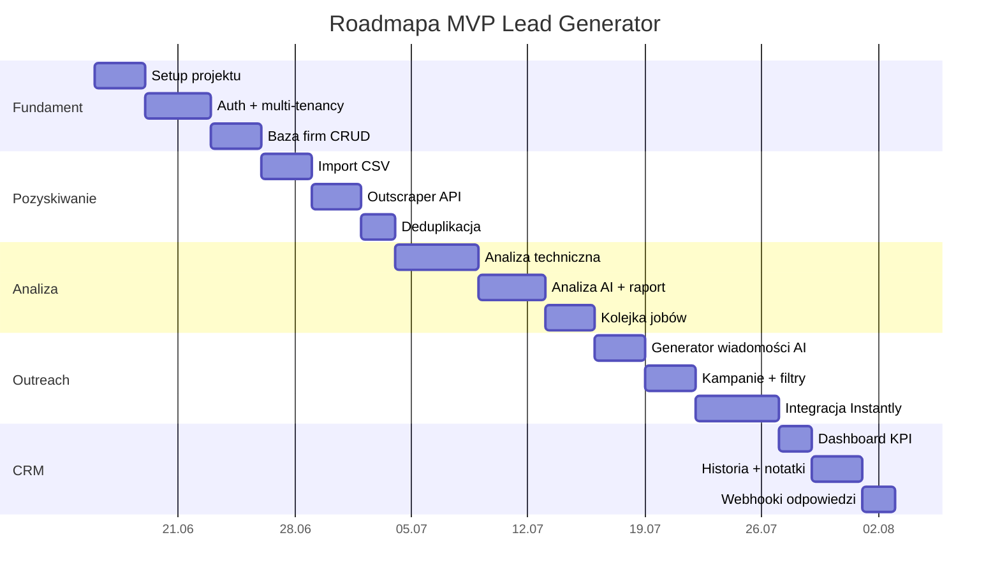
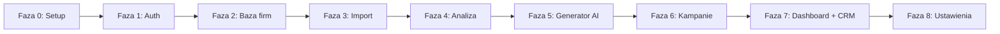

# Lead Generator — Roadmapa implementacji

Plan wdrożenia MVP w logicznych fazach. Każda faza kończy się działającym przyrostem wartości.

---

## Faza 0 — Fundament projektu

**Cel:** Działający szkielet aplikacji z połączeniem do bazy.

### Zadania

- [ ] Inicjalizacja projektu TanStack Start (`pnpm create`)
- [ ] Konfiguracja TypeScript, Tailwind CSS, shadcn/ui
- [ ] Docker Compose z PostgreSQL
- [ ] Prisma — migracja początkowa ze schematem
- [ ] `server/db.ts` — singleton Prisma Client
- [ ] Layout aplikacji: sidebar, header, routing `_app`
- [ ] `.env.example` ze wszystkimi zmiennymi

### Deliverable

Uruchomiona aplikacja z pustym panelem i połączeniem do PostgreSQL.

---

## Faza 1 — Autentykacja i multi-tenancy

**Cel:** Izolacja danych per organizacja, fundament SaaS.

### Zadania

- [ ] Model `User`, `Organization`, `OrganizationMember`
- [ ] Rejestracja / logowanie (sesje cookie)
- [ ] Middleware `auth` + `organization` na server functions
- [ ] Selektor organizacji (jeśli user w wielu)
- [ ] RBAC: `OWNER`, `ADMIN`, `MEMBER`
- [ ] Seed: organizacja „Pixel-app” + użytkownik demo

### Deliverable

Zalogowany użytkownik widzi panel przypisany do swojej organizacji.

---

## Faza 2 — Baza firm

**Cel:** CRUD firm ze statusami workflow.

### Zadania

- [ ] `CompanyRepository` + `CompanyService`
- [ ] Server functions: `listCompanies`, `getCompany`, `updateCompany`, `updateStatus`
- [ ] Strona `/companies` — tabela z sortowaniem i paginacją
- [ ] Filtry: status, branża, wynik, miasto
- [ ] Strona `/companies/:id` — szczegóły firmy
- [ ] Komponenty: `CompanyTable`, `CompanyStatusBadge`, `ScoreBadge`
- [ ] `ActivityLog` — logowanie zmian statusu

### Deliverable

Pełna lista firm z możliwością przeglądania i ręcznej zmiany statusu.

---

## Faza 3 — Import firm

**Cel:** Pozyskiwanie leadów z CSV i Outscraper API.

### Zadania

#### 3a. Import CSV

- [ ] Strona `/companies/import` — upload pliku
- [ ] Parser CSV (mapowanie kolumn Outscraper)
- [ ] `ImportJob` — śledzenie postępu
- [ ] `DeduplicationService` — normalizacja URL/email, wykrywanie duplikatów
- [ ] Raport importu: zaimportowane / duplikaty / błędy

#### 3b. Outscraper API

- [ ] `OutscraperClient` — wyszukiwanie po branży, kraju, limicie
- [ ] Formularz: branża, kraj, limit wyników, przycisk „Pobierz firmy”
- [ ] `OutscraperMapper` — mapowanie odpowiedzi API → `Company`
- [ ] Job `outscraper-fetch.job.ts` — async pobieranie
- [ ] `ApiCredential` — przechowywanie klucza Outscraper per org

### Deliverable

Import 100+ firm z CSV lub Outscraper z automatyczną deduplikacją.

---

## Faza 4 — Analiza stron WWW

**Cel:** Automatyczna ocena stron (techniczna + AI) z wynikiem 0–100.

### Zadania

#### 4a. Analiza techniczna

- [ ] `TechnicalAnalyzer` — moduł per check:
  - SSL (certyfikat, HTTPS)
  - Responsywność mobilna (viewport, heurystyki)
  - Formularz kontaktowy
  - Google Maps
  - Social media (FB, IG, LinkedIn, X)
  - Szybkość (fetch timing / PageSpeed API)
- [ ] Zapis wyników w `CompanyAnalysis`

#### 4b. Analiza AI

- [ ] `OpenAIClient` + prompty (`analysis.prompt.ts`)
- [ ] `AiAnalyzer` — ocena wyglądu, treści, CTA
- [ ] `ScoreCalculator` — agregacja techniczna + AI → wynik 0–100
- [ ] Kategoryzacja: Krytyczna / Słaba / Przeciętna / Dobra / Bardzo dobra
- [ ] Auto-update `Company.status` → `ANALYZED`, opcjonalnie `TO_CONTACT` (score < próg)

#### 4c. Raport AI

- [ ] Komponenty: `AnalysisReport`, `TechnicalChecks`, `ProblemsList`, `RecommendationsList`
- [ ] Widok raportu na `/companies/:id`
- [ ] Strona `/analysis` — kolejka i masowa analiza

#### 4d. Job queue

- [ ] `analyze-company.job.ts` — przetwarzanie w tle
- [ ] Progress tracking per firma
- [ ] Retry logic przy błędach sieciowych

### Deliverable

Kliknięcie „Analizuj” generuje pełny raport z wynikiem, problemami i rekomendacjami.

---

## Faza 5 — Generator wiadomości AI

**Cel:** Spersonalizowane emaile per firma.

### Zadania

- [ ] `MessageGeneratorService` + prompt (`email.prompt.ts`)
- [ ] Szablon:
  - Temat: „Kilka uwag dotyczących strony {{company_name}}”
  - Treść: wynik, 3 problemy, propozycja modernizacji, podpis Pixel-app
- [ ] Server function `generateMessage(companyId)`
- [ ] Komponent `MessagePreview` — podgląd przed wysyłką
- [ ] Zapis w `Message` (generatedByAi = true)

### Deliverable

Dla każdej przeanalizowanej firmy — unikalny email gotowy do wysyłki.

---

## Faza 6 — Kampanie mailingowe

**Cel:** Tworzenie kampanii z filtrami i wysyłka przez Instantly.

### Zadania

#### 6a. Kampanie (logika wewnętrzna)

- [ ] Strona `/campaigns` — lista kampanii
- [ ] Strona `/campaigns/new` — formularz z filtrami:
  - wynik poniżej progu
  - posiada email
  - status = Do kontaktu
- [ ] `CampaignService` — tworzenie kampanii, dobór leadów
- [ ] `CampaignLead` — powiązanie firma ↔ kampania

#### 6b. Integracja Instantly

- [ ] `InstantlyClient`:
  - tworzenie kampanii
  - dodawanie leadów
  - wysyłanie leadów do kampanii
  - pobieranie statystyk
  - pobieranie odpowiedzi
- [ ] Sync statystyk: sent, open, reply
- [ ] Webhook `POST /api/webhooks/instantly`:
  - nowa odpowiedź → `Reply` + `Company.status = REPLIED`
  - `ActivityLog` typu `REPLY_RECEIVED`
- [ ] Strona `/campaigns/:id` — statystyki kampanii

### Deliverable

Kampania z 50 leadami wysłana przez Instantly ze śledzeniem odpowiedzi.

---

## Faza 7 — Dashboard i CRM

**Cel:** Panel KPI i pełna historia kontaktu z leadem.

### Zadania

#### 7a. Dashboard

- [ ] `DashboardService` — agregaty:
  - liczba firm w bazie
  - liczba przeanalizowanych stron
  - liczba firm do kontaktu
  - liczba wysłanych wiadomości
  - liczba odpowiedzi
- [ ] Strona `/dashboard` — karty KPI (`StatsCards`)
- [ ] Opcjonalnie: wykres trendów (ostatnie 30 dni)

#### 7b. CRM

- [ ] `CrmService` — agregacja historii z `ActivityLog`, `Message`, `Reply`, `Note`
- [ ] Komponent `ActivityTimeline` na `/companies/:id`
- [ ] `NoteForm` — dodawanie notatek
- [ ] `ReplyCard` — wyświetlanie odpowiedzi
- [ ] Filtrowanie historii po typie zdarzenia

### Deliverable

Dashboard z metrykami + pełna historia CRM per firma.

---

## Faza 8 — Ustawienia i szlif

**Cel:** Konfiguracja integracji, UX, stabilność.

### Zadania

- [ ] `/settings/integrations` — zarządzanie kluczami API (Outscraper, Instantly, OpenAI)
- [ ] `CredentialService` — szyfrowanie / odszyfrowywanie kluczy
- [ ] Walidacja kluczy API (test connection)
- [ ] Obsługa błędów i toast notifications
- [ ] Loading states, empty states
- [ ] Responsywność mobilna panelu

### Deliverable

Produkcyjnie gotowy MVP z konfigurowalnymi integracjami.

---

## Priorytetyzacja zależności

---

## Kryteria akceptacji MVP

| # | Funkcjonalność | Kryterium |
|---|----------------|-----------|
| 1 | Dashboard | 5 metryk KPI widocznych po zalogowaniu |
| 2 | Import CSV | Import 500 rekordów z raportem duplikatów |
| 3 | Outscraper | Formularz pobiera firmy i zapisuje do bazy |
| 4 | Baza firm | Tabela z 7 polami + status + wynik |
| 5 | Analiza | 6 checków technicznych + ocena AI 0–100 |
| 6 | Raport AI | Problemy + rekomendacje per firma |
| 7 | Kampanie | Filtry: score, email, status |
| 8 | Instantly | Kampania utworzona, leady wysłane, statystyki |
| 9 | Generator AI | Unikalny email per firma z podpisem Pixel-app |
| 10 | CRM | Historia: analiza, wiadomości, odpowiedzi, notatki |

---

## Ryzyka i mitigacje

| Ryzyko | Wpływ | Mitygacja |
|--------|-------|-----------|
| Rate limits OpenAI / Outscraper | Blokada importu/analizy | Kolejka z throttlingiem per org |
| Strony bez WWW | Brak analizy | Status NEW, flaga „brak strony” |
| Duplikaty z różnych źródeł | Zanieczyszczona baza | Unique index + normalizacja URL |
| Webhook Instantly niedostępny | Brak sync odpowiedzi | Polling co 15 min jako fallback |
| Długi czas analizy | Złe UX | Async jobs + progress bar |
| Koszty API | Przekroczenie budżetu | Limity per organizacja (przyszły `Plan`) |

---

## Po MVP — backlog SaaS

1. **Billing** — Stripe + plany (`Plan`, `Subscription`)
2. **Zaproszenia** — invite link do organizacji
3. **Szablony emaili** — edytowalne per organizacja
4. **White-label** — logo i podpis agencji
5. **Eksport PDF** — raport analizy do wysłania klientowi
6. **Webhooki wychodzące** — integracja z Zapier/Make
7. **API publiczne** — REST API dla partnerów
8. **Audit log** — pełna historia działań użytkowników
